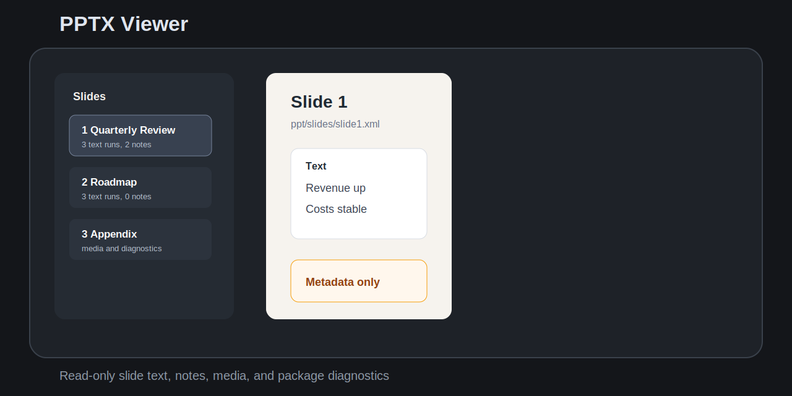

# Slide Deck Viewer

Slide Deck Viewer opens `.pptx` slide decks as a read-only inspection view inside the app. It focuses on slide text, speaker notes, media metadata, relationships, warnings, and package diagnostics.



## Features

- Opens `.pptx` files from the file explorer with a dedicated read-only view.
- Parses the local OOXML zip package in the plugin with no cloud conversion.
- Shows slide navigation, extracted text, speaker notes, media references, and package diagnostics.
- Filters slide text, speaker notes, and media metadata.
- Warns about external relationships, embedded OLE/package content, macros, large decks, encrypted files, and malformed packages.
- Caps large render lists so big decks stay responsive.

## Non-goals

- No `.ppt` legacy binary support in v0.1.
- No editing, saving, annotation, export, or write-back.
- No pixel-perfect PowerPoint rendering.
- No macro, VBA, OLE, or embedded object execution.
- No remote fonts, remote images, network calls, or cloud conversion.
- No launching PowerPoint, Keynote, LibreOffice, or another external viewer.
- No Markdown slide authoring or presentation mode.

## Install from release

1. Download `main.js`, `manifest.json`, and `styles.css` from the matching GitHub release.
2. Place them in `.obsidian/plugins/slide-deck-viewer/`.
3. Enable `Slide Deck Viewer` in Community plugins.

## Development

```bash
npm install
node scripts/create-fixtures.mjs
npm run build
npm run typecheck
npm test
npm run community:check
```

## Community review checklist

- Plugin id is `slide-deck-viewer`.
- `manifest.json` version matches `versions.json`.
- Release tag is exactly `0.1.1`, not `v0.1.1`.
- Release includes `main.js`, `manifest.json`, and `styles.css`.
- Runtime code does not use network, clipboard, shell, eval, write-back, or external app launch APIs.
- Manifest description avoids restricted product-name wording.
- Styles avoid `!important`.
- The viewer is read-only and handles unsupported decks gracefully.

## License

MIT

